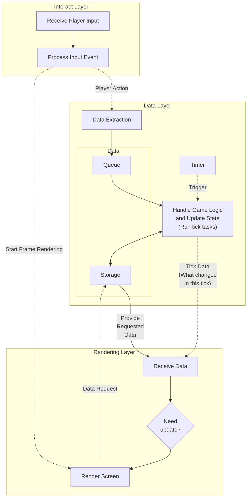

### In-Depth Project Overview

In this chapter, we aim to provide an in-depth look at the project structure, detailing how different components interact to create a dynamic and immersive gaming experience.

## Layers

The project is divided into three main layers: the Interact Layer, Data Layer, and Rendering Layer. These layers work together to handle player input, manage game data, and render the game state, respectively.

### Core Components

- **Event Bus**: Facilitates communication between the different layers.
- **Game Ticks**: Divided into scheduled ticks and random ticks, they handle fixed-frequency tasks and random events.
- **Data Storage**: Manages all game data storage and retrieval.
- **Event Queue**: Collects events generated from player actions or internal game logic for processing.

Each layer has its own set of responsibilities and communicates with the others through an event bus, ensuring efficient transmission of information and control signals.

## Project Structure Diagram

## Detailed Architecture

1. **Rendering Layer**:

   - **Function**: Renders the game state into a 2D view for the player. It requests necessary data (e.g., chunk data) from the Data Storage within the Data Layer.
   - **Modules**: Rendering engine, graphics processing, UI display, etc.

2. **Data Layer**:

   - **Function**: Handles all game data, including the execution of game ticks, block updates, entity AI calculations, and data storage.
   - **Modules**: Game logic processing, physics calculations, state management, and data storage.
   - **Game Ticks**:
     - **Scheduled Ticks**: Executes every 100 milliseconds (0.1 seconds), handling tasks such as block updates and entity movements.
     - **Random Ticks**: In each scheduled tick, randomly selects a block in each chunk to handle random events.
   - **Data Storage**: Manages all game data storage and retrieval.
   - **Event Queue**: Collects events generated from player actions or internal game logic for processing.

3. **Interact Layer**:
   - **Function**: Receives player inputs (keyboard events) and responds by sending commands to the Data Layer and directly triggering the Rendering Layer for immediate updates.
   - **Modules**: Input processing, event management, etc.
   - **Key Path**: `src/control/`

## Module Interaction

The game's architecture uses an event bus to facilitate communication between the three core layers: the Rendering Layer, Data Layer, and Interact Layer. The event bus ensures efficient transmission of control signals and data between these layers.

The Event Bus transmits the following types of data:

- **Control Flow**:
  - The Interact Layer sends control signals to the Data Layer, e.g., when the player moves.
  - The Interact Layer triggers the Rendering Layer for immediate updates, ensuring real-time reflection of player actions.
  - The Data Layer processes game logic, updates the game state, and sends updated data to the Rendering Layer, triggering rendering as needed.
- **Data Flow**:
  - The Data Layer sends updated data to the Rendering Layer.
  - The Rendering Layer requests necessary data from Data Storage within the Data Layer when needed.

This design ensures effective interaction between layers, enabling real-time responsiveness and smooth data processing.

## Conclusion

In this section, we provided an overview of the project's architecture and its core features, laying the foundation for deeper understanding and development. By understanding the design of Input-Magic, you’re now equipped to dive deeper. Just like a wizard learns the basics of spellcasting before tackling more complex enchantments, let's get ready to explore the detailed architecture of our game in the following chapters!
